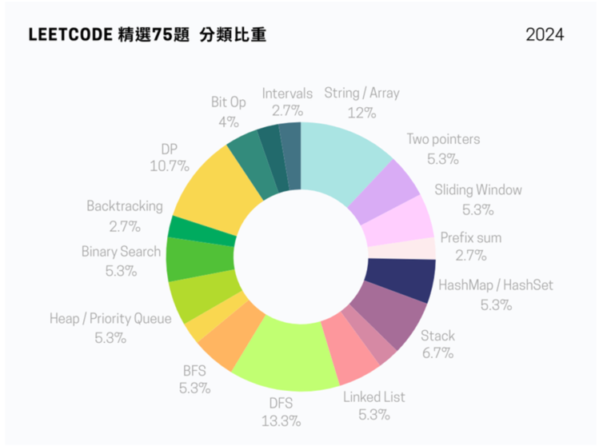
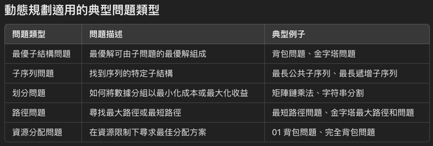
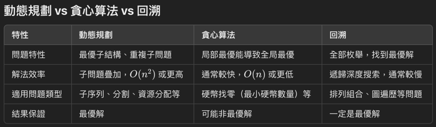

# myLeetcode

&nbsp;
&nbsp;
&nbsp;
&nbsp;

LeetCode Solution in C

## Topics
- [Arrays](#arrays)
- [Bit](#bit)
- [Linked List](#linked-list)
- [Hash Table](#hash-table)
- [String](#string)
- [Double pointer](#Double-pointer)
- [Stack/Queue](#stackqueue)
- [Tree](#tree)
- [Heap](#heap)
- [Graph](#graph)
- [Greedy](#greedy)
- [Backtracking](#backtracking)
- [Divide and Conquer](#divide-and-conquer)
- [Dynamic Programming](#dynamic-programming)

  <b><a href="#topics">↥ Back To Top</a></b>

## Arrays
| # | Title | Solution | Difficulty |
|:-:|-|-|-|
|1|[2-sum](https://leetcode.com/problems/two-sum/)| [py](/arrays/2-sum/2-sum.py)|EASY|
|11|[Container With Most Water](https://leetcode.com/problems/container-with-most-water/)|[py](arrays/container-with-most-water/container-with-most-water.py|Medium|
|26|[Remove Duplicates from Sorted Array](https://leetcode.com/problems/remove-duplicates-from-sorted-array/)|[C](arrays/remove-duplicates-from-sorted-array/remove-duplicates-from-sorted-array.c) [py](arrays/remove-duplicates-from-sorted-array/remove-duplicates-from-sorted-array.py)|EASY|
|27|[Remove Element](https://leetcode.com/problems/remove-element/)|[C](arrays/remove-element/remove-element.c) [py](arrays/remove-element/remove-element.py)|EASY|
|33|[Search in Rotated Sorted Array](https://leetcode.com/problems/search-in-rotated-sorted-array/description/)|[py](arrays/search-in-rotated-sorted-array/search-in-rotated-sorted-array.py)|Medium|
|53|[Maximum Subarray](https://leetcode.com/problems/maximum-subarray/)|[py](arrays/maximum-subarray/maximum-subarray.py)|Medium|
|121|[Best Time to Buy and Sell Stock](https://leetcode.com/problems/best-time-to-buy-and-sell-stock/)|[py](arrays/best-time-to-buy-and-sell-stock/best-time-to-buy-and-sell-stock.py)|EASY|
|152|[Maximum Product Subarray](https://leetcode.com/problems/maximum-product-subarray/)|[py](arrays/maximum-product-subarray/maximum-product-subarray.py)|Medium|
|153|[Find Minimum in Rotated Sorted Array](https://leetcode.com/problems/find-minimum-in-rotated-sorted-array/description/)|[py](arrays/find-minimum-in-rotated-sorted-array/find-minimum-in-rotated-sorted-array.py)|Medium|
|217|[Contains Duplicate](https://leetcode.com/problems/contains-duplicate/description/)|[py](arrays/contains-duplicate/contains-duplicate.py)|EASY|
|238|[Product of Array Except Self](https://leetcode.com/problems/product-of-array-except-self/description/)|[py](arrays/product-of-array-except-self/product-of-array-except-self.py)|Medium|
|283|[Move Zeroes](https://leetcode.com/problems/move-zeroes/)|[C](arrays/move-zeroes/move-zero.c) [py](arrays/move-zero/move-zero.py)|EASY|
|704|[Binary Search](https://leetcode.com/problems/binary-search/)|[C](arrays/binary-search/binary-search.c) [py](arrays/binary-search/binary-search.py)|EASY|
|844|[Backspace String Compare](https://leetcode.com/problems/backspace-string-compare/)|[py](arrays/backspace-string-compare/backspace-string-compare.py)|EASY|
|977|[Squares of a Sorted Array](https://leetcode.com/problems/squares-of-a-sorted-array/)|[py](arrays/squares-of-a-sorted-array/squares-of-a-sorted-array.py)|EASY|
|1768|[Merge Strings Alternately](https://leetcode.com/problems/merge-strings-alternately/description/)|[py](arrays/merge-strings-alternately/merge-strings-alternately.py)|EASY|

  <b><a href="#topics">↥ Back To Top</a></b>

## Bit

## Linked List
| # | Title | Solution | Difficulty |
|:-:|-|-|-|
|21|[Merge Two Sorted Lists](https://leetcode.com/problems/merge-two-sorted-lists/)|[C](link-list/Merge-Two-Sorted-Lists/merge-two-sorted-list.c)|EASY|
|24|[Swap Nodes in Pairs](https://leetcode.com/problems/swap-nodes-in-pairs/)|[C](link-list/swap-nodes-in-pairs/swap-nodes-in-pairs.c)|MEDIUM|
|203|[Remove Linked List Elements](https://leetcode.com/problems/remove-linked-list-elements/)|[C](link-list/remove-linked-list-elements/remove-linked-list-elements.c)|EASY|
|206|[Reverse Linked List](https://leetcode.com/problems/reverse-linked-list/submissions/)|[C](link-list/reverse-linked-list/reverse-linked-list.c)|EASY|
|707|[Design Linked List](https://leetcode.com/problems/design-linked-list/)|[C](link-list/design-linked-list/design-linked-list.c)|MEDIUM|

  <b><a href="#topics">↥ Back To Top</a></b>

## Hash Table
| # | Title | Solution | Difficulty |
|:-:|-|-|-|
|1|[2-sum](https://leetcode.com/problems/two-sum/)|[C](/hash-table/2-sum/2-sum.c)   [py](/arrays/2-sum/2-sum.py)|EASY|
|242|[Valid Anagram](https://leetcode.com/problems/valid-anagram/)|[C](hash-table/valid-anagram/valid-anagram.c)|EASY|
|349|[Intersection of Two Arrays](https://leetcode.com/problems/intersection-of-two-arrays/)|[C](hash-table/intersection-of-two-arrays/intersection-of-two-arrays.c)|EASY|
|454|[4 sum II](https://leetcode.com/problems/4sum-ii/)|[C](/hash-table/4sumII/4sumII.c)|MEDIUM|
|1002|[Find Common Characters](https://leetcode.com/problems/find-common-characters/)|[C](hash-table/find-common-characters/find-common-characters.c)|EASY|

  <b><a href="#topics">↥ Back To Top</a></b>

## String
| # | Title | Solution | Difficulty |
|:-:|-|-|-|
|5|[Longest Palindromic Substring]
|14|[Longest Common Prefix](https://leetcode.com/problems/longest-common-prefix/)|[C](/tree/Binary%20Tree%20Preorder%20Traversal/Binary-Tree-Preorder-Traversal.c)|EASY|

  <b><a href="#topics">↥ Back To Top</a></b>

## Double pointer

## Stack/Queue

## Tree
| # | Title | Solution | Difficulty |
|:-:|-|-|-|
|94|[Binary Tree Inorder Traversal](https://leetcode.com/problems/binary-tree-inorder-traversal/)|[C](/tree/Binary%20Tree%20Inorder%20Traversal/Binary-Tree-Inorder-Traversal.c)|EASY|
|144|[Binary Tree Preorder Traversal](https://leetcode.com/problems/binary-tree-preorder-traversal/submissions/)|[C](/tree/Binary%20Tree%20Preorder%20Traversal/Binary-Tree-Preorder-Traversal.c)|EASY|
|145|[Binary Tree Postorder Traversal](https://leetcode.com/problems/binary-tree-postorder-traversal/)|[C](/tree/Binary%20Tree%20Postorder%20Traversal/Binary-Tree-Postorder-Traversal.c)|EASY|
|222|[Count Complete Tree Nodes](https://leetcode.com/problems/count-complete-tree-nodes//)|[C](/tree/%20Count%20Complete%20Tree%20Nodes/%20CountCompleteTreeNodes.c)|EASY|

  <b><a href="#topics">↥ Back To Top</a></b>

## Heap

## Graph

## Greedy

## Backtracking

## Divide and Conquer

## Dynamic Programming
| # | Title | Solution | Difficulty |
|:-:|-|-|-|
|5|[Longest Palindromic Substring](https://leetcode.com/problems/longest-palindromic-substring)|[py](/Dynamic-Programming/longest-palindromic-substring/longest-palindromic-substring.py)|Medium|
|39|[Combination Sum](https://leetcode.com/problems/combination-sum/description/)|[py](/Dynamic-Programming/combination-sum/combination-sum.py)|Medium|
|70|[Climbing Stairs](https://leetcode.com/problems/climbing-stairs/)|[C](/Dynamic-Programming/climbing-stairs/climbing-stairs.c) [py](/Dynamic-Programming/climbing-stairs/climbing-stairs.py)|EASY|
|139|[Word Break](https://leetcode.com/problems/word-break/)|[py](/Dynamic-Programming/word-break/word-break.py)|Medium|
|300|[Longest Increasing Subsequence](https://leetcode.com/problems/longest-increasing-subsequence/description/)|[py](/Dynamic-Programming/longest-increasing-subsequence.py)|Medium|
|322|[Coin Change](https://leetcode.com/problems/coin-change/description/)|[py](/Dynamic-Programing/coin-change/coin-change.py)|Medium|
|1143|[Longest Common Subsequence](https://leetcode.com/problems/longest-common-subsequence/)|[py](/Dynamic-Programing/longest-common-subsequence/longest-common-subsequence.py)|Medium|

  <b><a href="#topics">↥ Back To Top</a></b>

## Algorithm
| Algorithm | Solution | Proposal |
|-|-|-|
|動態規劃|在處理字串、數列或序列相關的問題時，計算兩個序列的相似性或關係。 <li> 最長公共子序列（LCS)</li> <li> 編輯距離（Edit Distance）</li> <li> 最長遞增子序列（LIS）</li> 路徑優化問題 分割與組合問題 <li>01 背包問題</li> 數學與計算問題 <li>費波那契數列</li>||
|Kadane's |最大子陣列和問題 <li>$$dp[i] = \max(nums[i], dp[i-1] + nums[i])$$ </li> ||
|歸納法|踩樓梯問題: <li>$$(dp[i]=dp[i−1]+dp[i−2])$$</li> 硬幣總和問題: <li>$$(dp[i]=min(dp[i],dp[i−coin]+1) ∀ coin in coins$$</li> 硬幣組合: <li>$$(dp[i]=dp[i]+dp[i−coin])$$</li>||
|Backtracking(回朔法)|Combination Sum 問題||

  <b><a href="#topics">↥ Back To Top</a></b>

